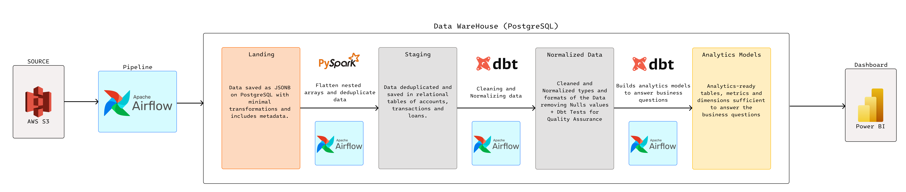
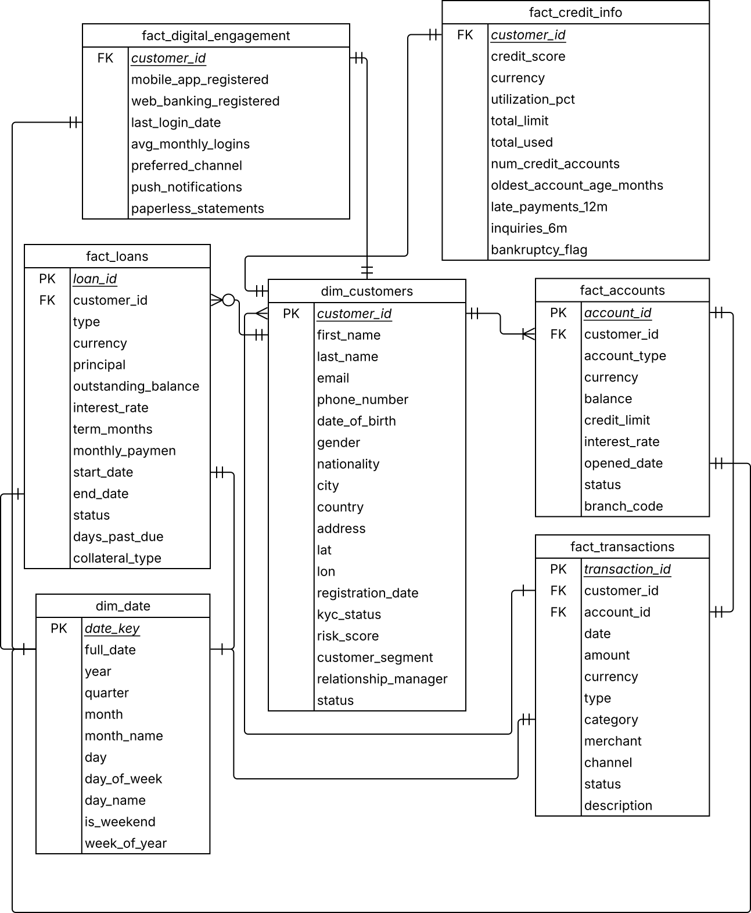
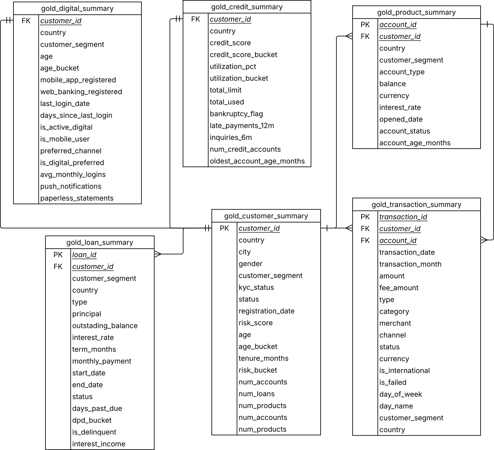
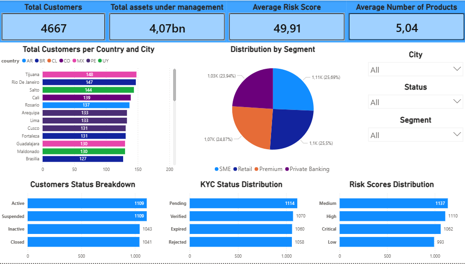
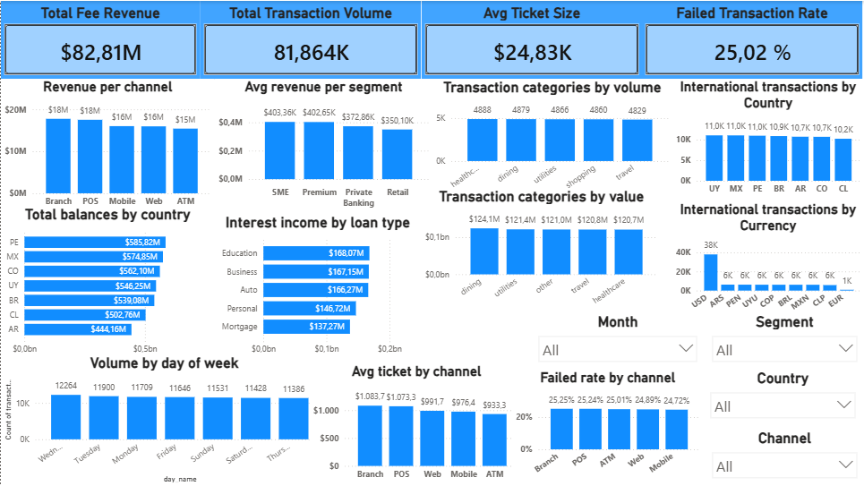
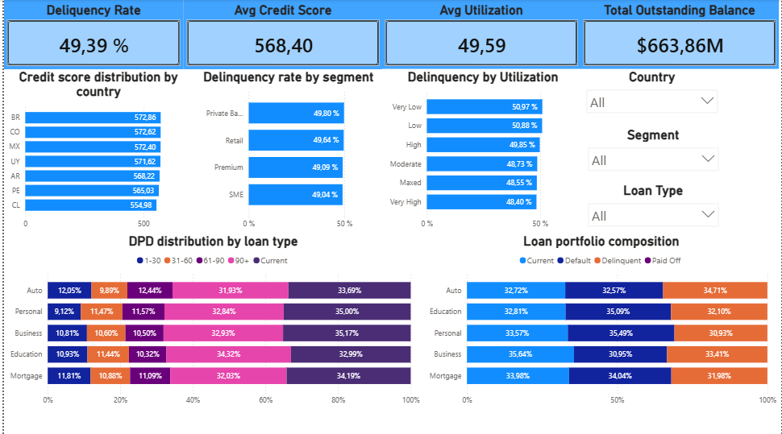
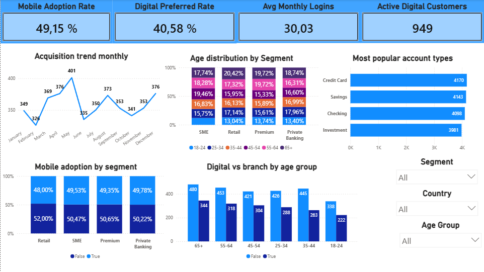

# elt_platform v2 — Fintech/Banking Data Engineering Project

A containerized ELT data platform using Docker Compose with Airflow, PostgreSQL, PySpark, dbt, and PowerBI.

## Project Overview

This project implements a modern data engineering pipeline for a LATAM Fintech/Banking dataset, following a Bronze-Silver-Gold data warehouse architecture. The pipeline ingests raw JSON data from S3, processes it with PySpark and dbt, and delivers business-ready analytics to PowerBI.

### Business Context

**Problem Statement**: A LATAM fintech lacks a unified, trusted view of customers, accounts, transactions, loans, and digital engagement, limiting growth and risk decisioning.

**Business Objectives**:
- Eliminate data silos by consolidating raw data into dependable analytical layers.
- Standardize metrics across countries and business lines for consistent KPI definitions.
- Improve data quality and lineage to increase trust in reporting.
- Deliver timely dashboards for segmentation, credit risk monitoring, operational performance, fraud signals, and regulatory readiness.

**Expected Impact**:
- Faster experimentation and decision-making.
- Improved cross-sell, retention, and risk outcomes.
- Reliable, comparable analytics across regions and products.

### Architecture Diagram



```
S3 (JSON) → Airflow → Bronze → PySpark (Silver) → dbt (Silver) → dbt (Gold) → PowerBI
```

---

## Project Structure

```
Etl_project/
├── dags/                     # Airflow DAG definitions
|   ├── bronze_dag.py         # DAG for Bronze layer ingestion
|   ├── silver_dag.py         # DAG for Silver layer transformations
|   ├── gold_dag.py           # DAG for Gold layer transformations
│   └── elt_platform_pipeline.py  # Main DAG orchestrating the pipeline
├── spark/                    # PySpark scripts
├── dbt/                      # dbt project
|   ├── macros/               # dbt macros
│   ├── models/
│   │   ├── bronze/           # Raw data staging
│   │   ├── silver/           # Cleaned and normalized data
│   │   └── gold/             # Business analytics
│   ├── tests/                # dbt tests
│   ├── dbt_project.yml       # dbt configuration
│   └── profiles.yml          # Database connections
├── powerbi/                  # PowerBI deliverables
│   ├── dashboard.pbix        # PowerBI file with 4 pages of visualizations
│   └── screenshots/          # Dashboard page screenshots
├── data/
│   └── raw/                  # Raw input data
├── docker-compose.yml        # Docker environment setup
├── env.example               # Environment variables template
├── requirements.txt          # Python dependencies
├── .gitignore
├── .pre-commit-config.yaml   # Code quality hooks
├── EDA.md                    # Data exploration and processing decisions
├── BUSINESS_QUESTIONS.md     # Answers to all 24 business questions
└── README.md                 # This file
```

---

## Quick Start

### Prerequisites

- Docker and Docker Compose installed
- At least 4GB RAM available
- PowerBI Desktop (for dashboard creation)

### Setup

1. **Clone the repository and setup environment**:
```bash
git clone git@github.com:Lucho-digi/Etl_project.git
cd Etl_project
cp env.example .env
```
Fill in the required environment variables in `.env` before starting. It's recommended to use a dedicated `POSTGRES_PORT` to avoid conflicts with any existing local PostgreSQL installation — if you change it, update `docker-compose.yml` accordingly.

2. **Start services**:
```bash
docker compose up -d --build
```

3. **Verify services are running**:
```bash
docker compose ps
```

4. **Access Airflow UI**: http://localhost:8080
Define user and password in `.env` before starting. Default credentials for testing:
> User: admin \
> Password: admin

5. **Trigger the pipeline**:
```bash
docker compose exec airflow airflow dags trigger elt_platform_pipeline
```

---

## Access Points

| Service | URL / Connection | Credentials |
|---------|-----------------|-------------|
| Airflow UI | http://localhost:8080 | define in .env |
| PostgreSQL | localhost:5432 | define in .env |
| Database | elt_platform | — |

---

## Common Commands

### dbt
```bash
# Enter dbt container
docker compose exec dbt bash

# Run all models
dbt run

# Run specific layer
dbt run --models bronze
dbt run --models silver
dbt run --models gold

# Load seed data (fx_rates)
dbt seed

# Test data quality
dbt test

# List models
dbt ls --resource-type model
```

### Airflow
```bash
# View logs
docker compose logs -f airflow

# List DAGs
docker compose exec airflow airflow dags list

# Trigger DAG
docker compose exec airflow airflow dags trigger <dagname>

# Check DAG run status
docker compose exec airflow airflow dags list-runs -d <dagname>
```

### PySpark
```bash
# Test PySpark interactively
docker compose exec airflow python -c "from pyspark.sql import SparkSession; print('PySpark OK')"
```

### Database Access
```bash
# Connect to PostgreSQL
docker compose exec postgres psql -U elt_platform-admin -d elt_platform

# View schemas
\dn

# View tables in a schema
\dt bronze.*
\dt silver.*
\dt gold.*

# Describe a table
\d <schema>.<table_name>
```

---

## Architecture

This project implements a **Bronze-Silver-Gold** data warehouse architecture:

- **Bronze**: Raw JSON from S3 stored as-is in PostgreSQL (`jsonb`). No transformations — this is the source of truth and the safety net for the entire pipeline.
- **Silver (PySpark)**: Reads Bronze via JDBC, explodes nested arrays (`accounts[]`, `transactions[]`, `loans[]`) into relational staging tables, and deduplicates. Writes back to the `silver` schema.
- **Silver (dbt)**: Cleans and standardizes PySpark output — type casting, boolean normalization, date parsing, NaN handling, categorical standardization, and city name corrections. Builds dimension and fact tables.
- **Gold (dbt)**: Analytics models that answer 24 business questions. Revenue calculations, risk bucketing, and age/tenure computations all live here. Amounts converted to USD via dbt seeds.
- **PowerBI**: Connects directly to the `gold` schema. 4-page dashboard with slicers for country, segment, and channel.

### Role of Main Technologies

| Technology | Role |
|------------|------|
| **Airflow** | Orchestrates the full ELT pipeline via DAGs |
| **PostgreSQL** | Single warehouse for bronze, silver, and gold schemas |
| **PySpark** | Flattens nested JSON arrays and deduplicates entities |
| **dbt** | SQL transformations, testing, and documentation |
| **PowerBI** | 4-page dashboard connected to gold schema |
| **Docker** | Containerized and reproducible environment |

---

## Data Model

The dataset covers 6 entities: Customers, Accounts, Transactions, Loans, Credit Info, and Digital Engagement.

PySpark flattened the nested arrays and dbt finished flattening the nested objects (`credit_info`, `digital_engagement`). The Silver ERD:



### Silver — Dimensions and Facts

| Table | Type | Grain | Description |
|-------|------|-------|-------------|
| `dim_customers` | Dimension | One row per customer | Demographics, risk score, KYC, segment |
| `dim_date` | Dimension | One row per calendar day | Date attributes for time-series analysis |
| `fact_accounts` | Fact | One row per account | Balances, types, interest rates |
| `fact_transactions` | Fact | One row per transaction | Amounts, channels, types, statuses |
| `fact_loans` | Fact | One row per loan | Principal, rates, DPD, status |
| `fact_credit_info` | Fact | One row per customer | Credit score, utilization, bankruptcy flag |
| `fact_digital_engagement` | Fact | One row per customer | Login history, channel preferences |

### Gold — Analytics Models

| Model | Grain | Business Questions |
|-------|-------|-------------------|
| `gold_customer_summary` | One row per customer | Q9, Q10, Q11, Q12, Q13, Q14, Q24 |
| `gold_financial_summary` | One row per customer | Q1, Q2, Q4 |
| `gold_transaction_summary` | One row per transaction | Q3, Q15, Q16, Q17, Q18, Q19 |
| `gold_loan_summary` | One row per loan | Q5, Q7, Q8, Q23 |
| `gold_credit_summary` | One row per customer | Q6, Q7 |
| `gold_digital_summary` | One row per customer | Q20, Q21 |
| `gold_product_summary` | One row per account | Q22 |

For full documentation of data quality decisions, NULL handling, and Gold layer design rationale, see [EDA.md](EDA.md).

The Gold ERD: 

---

## PySpark Logic

Scripts live in `spark/` and are triggered from Airflow as part of the silver DAG.

**`dedup.py`** — Reads `bronze.raw_fintech_data`, extracts flat customer fields into `silver.stg_raw_deduplicated`. Deduplication: keep the record with fewest NULLs in key fields; tie-break by earliest `registration_date`.

**`flatten_*.py`** — Explodes `*[]` into individual rows. Deduplication keeps the most complete record per `*_id`.

---

## PowerBI Dashboard

Connects directly to PostgreSQL (`gold` schema). All amounts in USD using fixed exchange rates as of 2026-05-20.

### Page 1 — Executive Overview



**What it shows**: High-level KPIs and customer base breakdown across 7 LATAM countries.

**Key metrics**: 4,667 customers · $4.07bn AUM · avg risk score 49.91 · avg 5.04 products per customer

**Business questions answered**: Q9, Q10, Q13, Q14, Q24

**Decisions it supports**: Geographic expansion priorities · compliance monitoring via KYC · risk appetite via risk buckets · cross-sell opportunities via product count

---

### Page 2 — Revenue & Transactions



**What it shows**: Revenue breakdown, transaction patterns, channel performance, and international activity.

**Key metrics**: $82.81M fee revenue · 81,864 transactions · $24.83K avg ticket · 25.02% failure rate

**Business questions answered**: Q1, Q2, Q3, Q4, Q15, Q16, Q17, Q18, Q19

**Note on Q3**: Revenue by channel shows fee revenue only — interest income comes from loans and can't be attributed to a transaction channel.

**Decisions it supports**: Channel investment · product pricing · operational capacity planning · international expansion

---

### Page 3 — Risk & Credit



**What it shows**: Credit quality, delinquency, and loan portfolio health.

**Key metrics**: 49.39% delinquency rate · avg credit score 568 (fair) · avg utilization 49.59% · $663.86M outstanding balance

**Business questions answered**: Q5, Q6, Q7, Q8, Q23

**Note on Q7**: No meaningful relationship between utilization and delinquency was found — consistent with the synthetic dataset.

**Note on Q23**: Paid Off loans don't appear in portfolio composition since their outstanding balance is $0 by definition — this is correct behavior.

**Decisions it supports**: Credit policy · loan provisioning · portfolio rebalancing · country-level risk monitoring

---

### Page 4 — Customer & Engagement



**What it shows**: Acquisition trends, demographics, digital adoption, and product preferences.

**Key metrics**: 49.15% mobile adoption · 40.58% digital preferred · 30.03 avg monthly logins · 949 active digital customers

**Business questions answered**: Q11, Q12, Q20, Q21, Q22

**Decisions it supports**: Digital channel investment · targeted onboarding · product development priorities · acquisition strategy

---

## Key Findings

- Customer base is evenly distributed across 7 LATAM countries — no dominant market.
- Average credit score of 568 is in the `fair` bucket across all countries — mid-risk base with room for credit product growth.
- Mobile adoption is ~49% across all segments — significant digital growth opportunity, especially in older age groups.
- Fee revenue is evenly distributed across channels (~$15–18M each).
- Education and Business loans generate the highest interest income ($168M and $167M).
- Credit Card is the most popular account type (4,170), followed by Savings (4,143).
- No strong correlation between utilization and delinquency, or between age and digital preference — consistent with synthetic data generation.

For detailed answers to all 24 business questions, see [BUSINESS_QUESTIONS.md](BUSINESS_QUESTIONS.md).

---

## Assumptions & Design Decisions

Key assumptions — full documentation in [EDA.md](EDA.md):

- **Currency**: Fixed exchange rates as of 2026-05-20. No real-time FX.
- **Revenue**: Fee revenue = `completed` fee transactions only. Interest income = `principal × (rate/100) × (term_months/12)` — simplified annualized proxy.
- **International transactions**: Any currency that doesn't match the customer's country default (e.g. CO → COP). USD is international for all 7 countries.
- **Active customer**: Open account + logged in within last 90 days.
- **Paid-off loans**: Excluded from outstanding balance — no active exposure.

---

## Git Tags (Milestones)

| Tag | Milestone |
|-----|-----------|
| `v0.1.0-bronze` | Bronze layer complete |
| `v0.2.0-silver` | Silver layer complete |
| `v0.3.0-gold` | Gold layer complete |
| `v0.4.0-powerbi` | PowerBI dashboard complete |
| `v1.0.0` | Final submission |

---

## Cleanup

```bash
# Stop services
docker compose down

# Remove volumes (deletes all data)
docker compose down -v

# Remove images
docker compose down --rmi local
```
